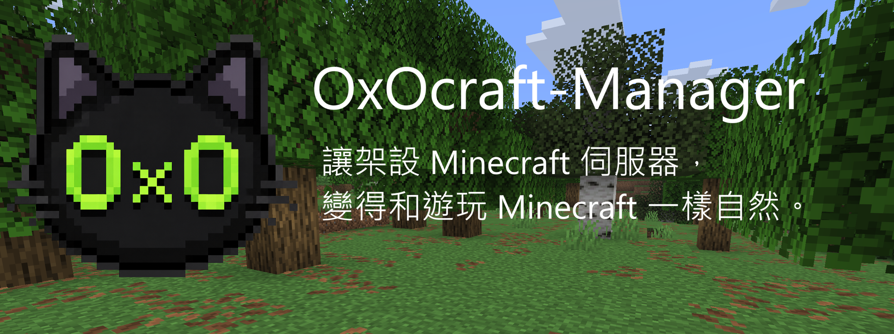
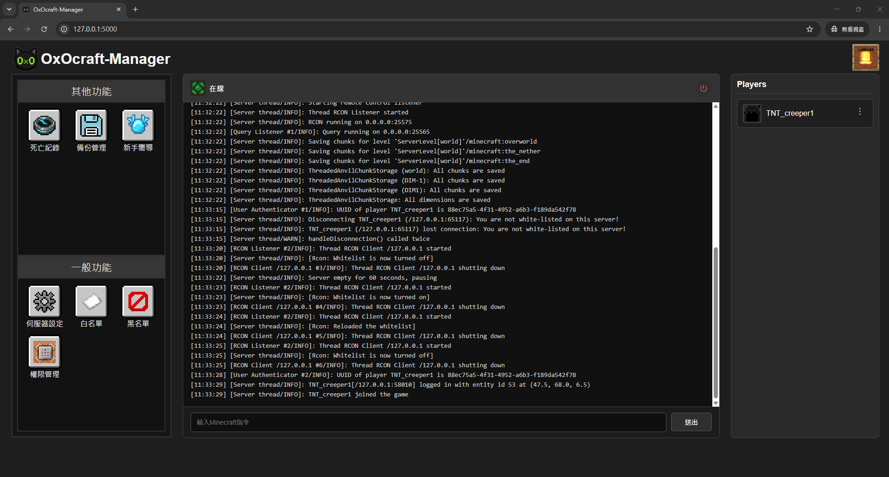
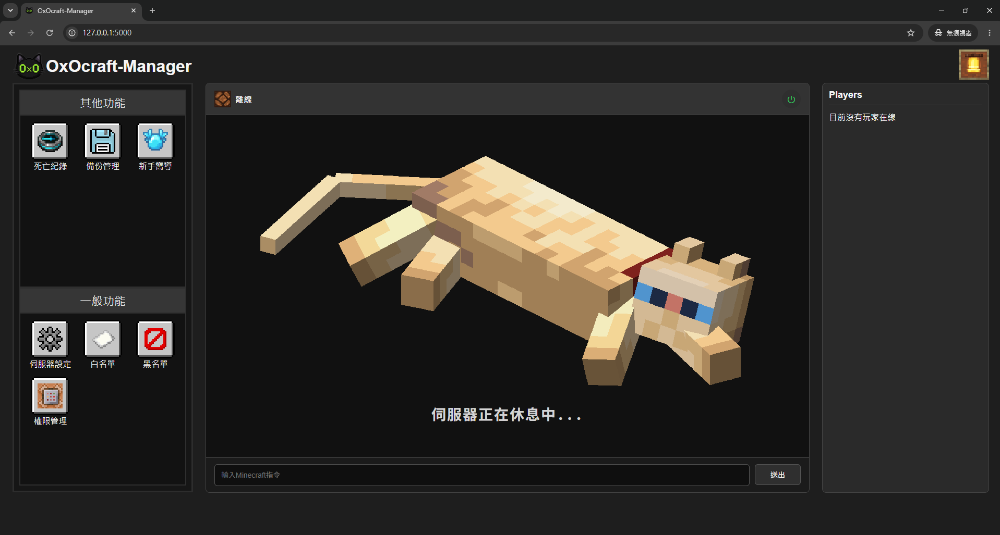
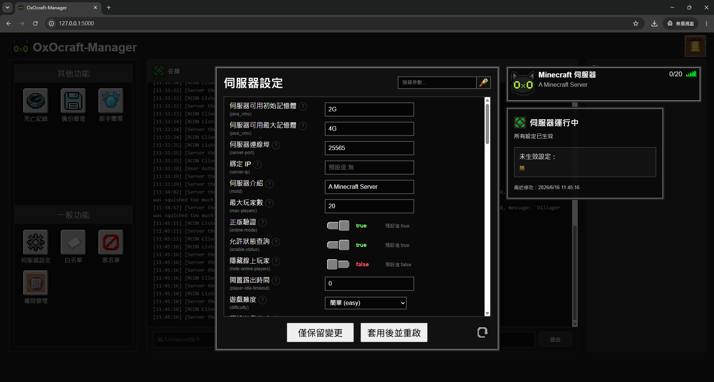
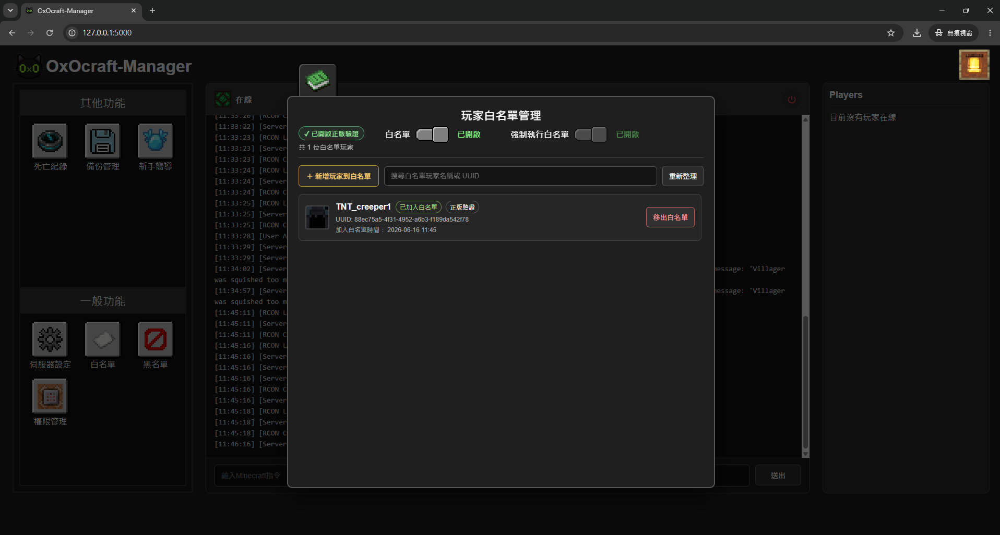
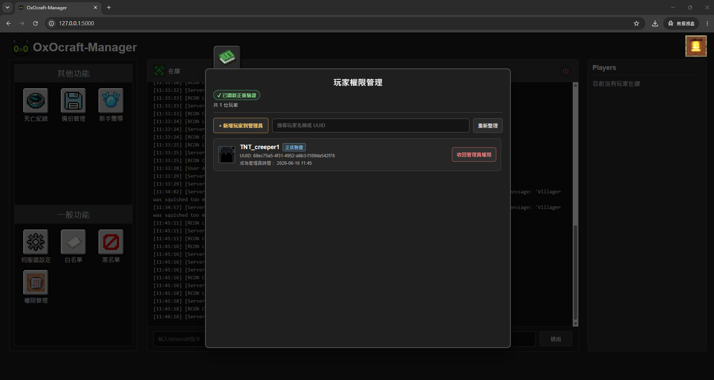
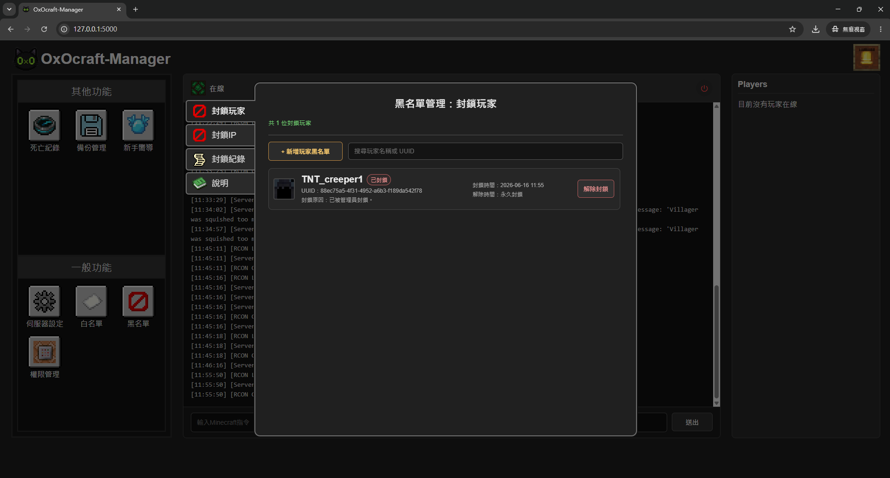
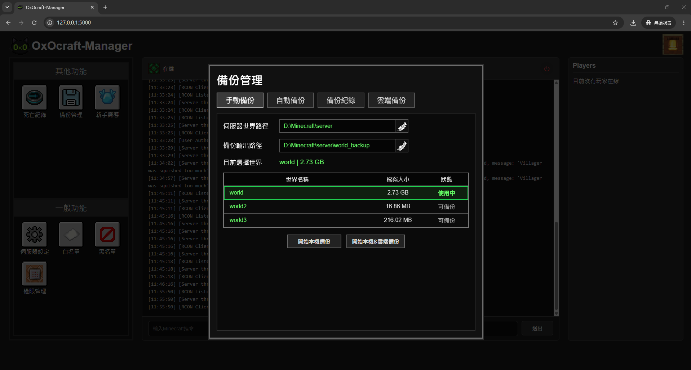
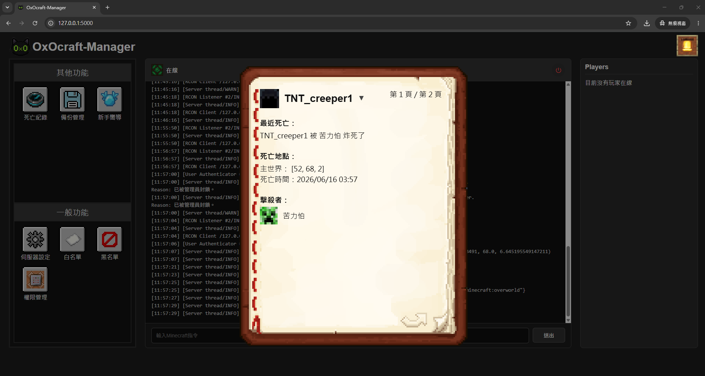

<!-- ========================================================= -->

<!-- Hero -->

<!-- ========================================================= -->

---

  

---

  一款由 Minecraft 玩家打造，專為 Minecraft 玩家設計的 Supports Minecraft Java Edition 伺服器管理工具。

<!-- TODO：GitHub Badges -->

[📖 Wiki](../../wiki)
  •  
[📝 Changelog](CHANGELOG.md)
  •  
[🚀 Releases](../../releases)

## Minecraft Server，應該更容易管理。

OxOcraft-Manager 希望降低 Minecraft Server 的學習門檻，而不是改變 Minecraft 原本的運作方式。

它將繁瑣的設定、玩家管理與伺服器操作整合到同一個介面，讓第一次架設伺服器的玩家能更容易開始，同時保留進階玩家所需要的操作彈性。

不論你是第一次與朋友一起建立 Minecraft 世界，還是已經熟悉 Minecraft Server 的管理流程，OxOcraft-Manager 都希望成為一個容易理解、值得信任且持續陪伴玩家成長的工具。

<!-- ========================================================= -->
<!-- Homepage Preview -->
<!-- ========================================================= -->

# 🏠 首頁預覽

    

OxOcraft-Manager 將 Minecraft Server 的日常管理整合到同一個介面，讓玩家能更直覺地管理伺服器，而不需要反覆修改設定檔或輸入大量指令。

首頁提供所有主要功能的快速入口，並即時顯示伺服器狀態，讓玩家能快速掌握目前 Server 的運行狀況。

---

# ✨ 核心特色

<table>
<tr>

<td width="50%" valign="top">

### 🎮 尊重 Minecraft 原生機制

所有功能都盡可能依照 Minecraft 原本的運作方式設計，而不是重新實作另一套管理邏輯。

</td>

<td width="50%" valign="top">

### 🧩 新手容易理解

將繁瑣的設定與管理流程轉換成直覺的操作介面，降低 Minecraft Server 的學習門檻。

</td>

</tr>

<tr>

<td width="50%" valign="top">

### ⚙️ 保留進階玩家操作空間

熟悉 Minecraft Server 的玩家，仍然可以依照自己的習慣與需求進行管理，而不是被工具限制操作方式。

</td>

<td width="50%" valign="top">

### 📖 不只是管理工具

除了提供管理功能外，也希望透過功能說明與教學，引導玩家逐步理解 Minecraft Server 的運作方式。

</td>

</tr>
</table>

<!-- ========================================================= -->
<!-- Features -->
<!-- ========================================================= -->

# 🚀 功能展示

OxOcraft-Manager 將 Minecraft Server 常用的管理功能整合到同一個介面，並盡可能保留 Minecraft 原本的管理邏輯，讓第一次接觸伺服器的玩家更容易理解，也讓熟悉 Minecraft Server 的玩家能維持原有的操作習慣。

---

# 🖥️ Server Control

    

透過單一介面即可完成 Minecraft Server 的啟動、關閉、Console 查看與指令執行。

伺服器狀態、Console 訊息與線上資訊都會即時更新，方便快速掌握目前 Server 的運行狀況。

---

# ⚙️ Server Settings

    

將 Minecraft 大量的 Server 設定整理成容易理解的介面。

除了修改設定外，也會提供功能說明、注意事項與相關提示，降低第一次接觸 Minecraft Server 的學習門檻。

---

# 📋 Whitelist

    

以視覺化方式管理 Minecraft 白名單。

系統會依照伺服器目前的運行狀態，自動採用符合 Minecraft 原生機制的管理方式，避免產生與實際伺服器不同步的情況。

---

# 🛡️ Permissions

    

透過直覺的介面管理玩家 OP 權限。

無論是正版模式或離線模式，皆會依照 Minecraft 原本的運作方式進行管理，降低操作失誤的可能。

---

# 🚫 Player Ban

    

整合玩家封鎖、IP 封鎖與封鎖紀錄。

提供更容易理解的管理方式，同時保留 Minecraft 原本的封鎖邏輯。

---

# 💾 Backup

    

提供世界備份管理功能，包含手動備份、自動備份以及備份管理，降低世界資料遺失的風險。

---

# 📖 Death Record

    

以 Minecraft 原版風格呈現玩家死亡紀錄。

讓死亡原因與相關資訊能以更直覺、更具遊戲氛圍的方式查看。

<!-- ========================================================= -->
<!-- Why OxOcraft-Manager -->
<!-- ========================================================= -->

# 💡 為什麼開發 OxOcraft-Manager？

OxOcraft-Manager 最初的起點，其實來自一個很單純的問題。

> **「為什麼玩了 Minecraft 十年的朋友，仍然對架設 Minecraft 伺服器不太了解？」**

Minecraft 已經陪伴許多玩家很多年，但真正接觸過伺服器架設的人其實並不多。

當第一次開始研究 Minecraft Server 時，除了伺服器本身，還需要理解 Java、設定檔、玩家管理、權限設定，甚至網路連線等許多陌生的知識。

對第一次接觸 Minecraft Server 的玩家而言，真正困難的地方，往往不是啟動伺服器，而是理解整個架設流程。

因此，我希望打造一套能夠：

- 讓第一次架設伺服器的玩家，也能安心完成設定。
- 不需要先理解大量參數，就能成功建立自己的 Minecraft Server。
- 在安全與實用之間取得平衡，而不是隱藏所有進階功能。
- 即使是熟悉 Minecraft Server 的玩家，也能提升日常管理效率。

OxOcraft-Manager 並不是為了取代 Minecraft 原本的管理方式。

而是希望透過更直覺的介面，降低 Minecraft Server 的學習門檻，同時保留 Minecraft 原本的運作方式與管理邏輯。

<!-- ========================================================= -->
<!-- Philosophy -->
<!-- ========================================================= -->

# 🎯 專案理念

OxOcraft-Manager 在設計每一項功能時，都遵循幾個核心理念。

### 🎮 尊重 Minecraft，而不是改變 Minecraft

所有功能都盡可能依照 Minecraft 原本的運作方式設計。

不是重新建立另一套管理規則，而是透過更容易理解的介面，協助玩家管理 Minecraft Server。

---

### 🌱 降低學習門檻，而不是限制功能

希望讓第一次接觸 Minecraft Server 的玩家也能快速開始，同時保留進階玩家所需要的操作彈性。

降低的是學習成本，而不是操作自由。

---

### 📖 一邊管理，一邊理解 Minecraft

OxOcraft-Manager 不希望玩家只是按下按鈕。

許多功能都會搭配說明、提示與教學，希望玩家在使用工具的同時，也能逐漸理解 Minecraft Server 的運作方式。

<!-- ========================================================= -->
<!-- Learning Resources -->
<!-- ========================================================= -->

# 📚 推薦學習資源

OxOcraft-Manager 專注於 Minecraft Server 的建立與管理。

如果你是第一次接觸 Minecraft Server，除了使用 OxOcraft-Manager 外，我也推薦搭配一些社群整理的優質教學一起學習。

由於不同電腦、網路設備與使用情境都有所不同，因此本專案不會重複撰寫網路相關教學，而是整理我實際使用或認為值得參考的學習資源，希望能幫助第一次架設 Minecraft Server 的玩家少走一些彎路。

---

## 🎮 與朋友一起遊玩（推薦新手）

**適合：**

- 第一次架設 Minecraft Server
- 與朋友一起遊玩
- 不需要公開對外

**推薦工具**

> Radmin VPN

**推薦影片**

影片名稱：minecraft 如何和朋友多人連線/使用radmin vpn來多人連線/如何架minecraft伺服器連線]

影片作者／來源：

> [carter chiang (火龍)](https://www.youtube.com/@carterchiang)

影片連結：

> [https://youtu.be/IChLD45NEsI?si=-B0eHr9nqI4hDHPP](https://youtu.be/IChLD45NEsI?si=-B0eHr9nqI4hDHPP)

## 📖 官方資源

Minecraft Wiki：

[> Minecraft Wiki](https://zh.minecraft.wiki/?variant=zh-tw)

Java 官方網站：

[> JAVA](https://www.java.com/zh-TW/)

<!-- ========================================================= -->
<!-- Roadmap -->
<!-- ========================================================= -->

# 🛣️ 開發 Roadmap

OxOcraft-Manager 仍在持續開發中。

未來將持續完善現有功能，同時加入更多 Minecraft Server 管理工具，希望讓玩家能透過同一套介面完成更多日常管理工作。

目前規劃方向包含：

- 功能持續完善
- UI / UX 優化
- 更多教學與引導
- 文件整理
- GitHub Wiki
- Plugin / Datapack 管理
- 更多 Server 管理功能

> Roadmap 可能會依照實際開發情況調整。

<!-- ========================================================= -->
<!-- Documentation -->
<!-- ========================================================= -->

# 📖 專案文件

如果你想進一步了解 OxOcraft-Manager 的設計理念、系統架構或功能細節，歡迎參考 GitHub Wiki。

內容將包含：

- 專案架構
- 功能流程
- Database
- API
- 設計理念
- 開發紀錄

📚 GitHub Wiki

[> OxOcraft-Manager 開發 Wiki](https://github.com/yuexuanOxO/OxOcraft-Manager/wiki)

<!-- ========================================================= -->
<!-- Feedback -->
<!-- ========================================================= -->

# 💬 回報問題與建議

如果你：

- 發現 Bug
- 有功能建議
- 想分享使用心得
- 想一起討論 Minecraft Server

都歡迎透過 GitHub Issue 與我交流。

每一則 Issue 我都會認真閱讀。

GitHub Issues：

[> BUG問題回報](https://github.com/yuexuanOxO/OxOcraft-Manager/issues)

<!-- ========================================================= -->
<!-- Closing -->
<!-- ========================================================= -->

# ❤️ 最後

OxOcraft-Manager 最初只是希望讓自己與朋友能更輕鬆地架設 Minecraft Server。

隨著功能逐漸完善，它也慢慢變成了一個希望能幫助更多 Minecraft 玩家管理伺服器的開源專案。

我不希望它只是另一個管理工具。

我更希望，它能成為許多玩家第一次接觸 Minecraft Server 時，一個容易理解、值得信任，也願意陪伴玩家一起成長的工具。

如果 OxOcraft-Manager 曾經幫助你少踩了一些坑，或讓你更理解 Minecraft Server 的運作方式，那就是這個專案最大的價值。

謝謝你的使用，也祝你和朋友們都能在 Minecraft 中留下更多值得回憶的故事。